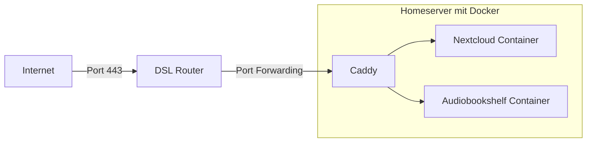
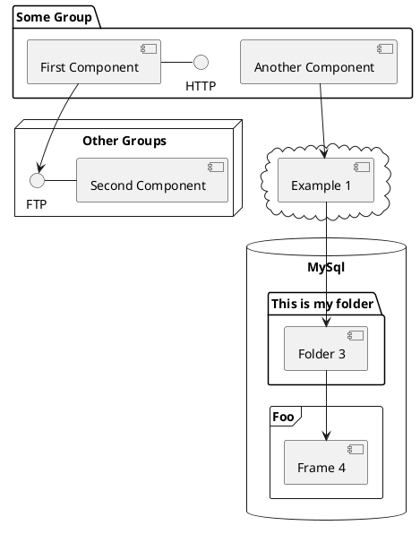

# Schulung Selfhosting

## Server zu Hause, statt IRGENDWO in der Cloud


---
transition: fade-out
---

# Agenda

* Überblick: Warum Selfhosting?
* Portfreigabe und Dyndns-Dienste
* Caddy als Reverse-Proxy für HTTPS
* Docker-compose Basics und Systemd-Template
* Konfigurieren und Betreiben von Diensten
* Weiter Übungen und individuelle Fragen

---
layout: default
---

# Motivation

* Unabhängigkeit von Drittanbietern
* Volle Kontrolle über die Daten
* Anpassungsfähigkeit und Flexibilität
* Kosteneffizienz
* Lernmöglichkeiten und Fähigkeitenentwicklung

---

# Warnungen

* Selfhosting ist nicht für jeden geeignet
* Selfhosting ist nicht für jeden Dienst geeignet
* Selfhosting ist nicht immer die einfachste/beste/günstigste/sicherste Lösung
* Wir schauen uns EINE Art an es zu machen

---

# Betriebssystem

* Ein beliebiges Linux-Betriebssystem
* Empfehlungen:
  * Debian Linux (stabil, einfach, viele Pakete, viele Anleitungen, viele Nutzer)
  * Raspberry Pi OS (baut auf Debian auf, für Raspberry Pi optimiert)
  * Ubuntu Server (stabil, einfach, viele Pakete)
* Prinzipiell geht auch jedes andere Linux-Betriebssystem (Sytemd und Docker müssen laufen)
* Gentoo, Arch Linux und NixOS sind tolle Betriebssysteme, aber nicht für Anfänger geeignet

---

# Hardware

* In diesem Kurs verwende ich eine Virtuelle Maschine mit Debian Linux
* Es kann aber auch andere Systeme verwendet werden
* Wichtig: Systemd und Docker müssen laufen
* Wir brauchen später den Pfad von `docker-compose` (je nach System Unterschiedlich)
* 1 GB Ram sollte ausreichen für Betriebssystem und Basis-Dienste
* Bei Resourcenhungrigen Diensten (z.B. Nextcloud) mehr Ram verwenden
* Der Computer / Raspberry Pi / VM braucht eine eigene IP-Adresse im lokalen Netzwerk (statisch/fest vergeben)

---

# Hardware anschaffen - Tipps

* Raspberry Pi 4/5, aber System auf externe SSD installieren
* Gebrauchte Hardware, oft sind Siemens, HP oder Dell Büro Desktops günstig zu bekommen (ca. 100-150€)
* Alternativ für diesen Kurs kann eine Virtuelle Maschine verwendet werden (z.B. Virtualbox)

---

# Portfreigabe

* Grundlagen der Portfreigabe
* Konfiguration des Routers für Selfhosting
* Auswahl und Einrichtung von Dyndns-Diensten
* Sicherheitsaspekte der Portfreigabe

---

# Konventionen

* Wir verwenden den Pfad `/opt/data` für alle Daten
* Wir verwenden den Pfad `/opt/dockerfiles` für alle docker-compose Dateien
* Wir verwenden den Namen `dc@.service` für unsere Template-Datei

---

# Portfreigabe 1

* Portfreigabe ist notwendig, um Dienste von außen erreichbar zu machen
* Manche Service Provider erlauben keinerlei Portfreigaben
* Portfreigabe ist ein Sicherheitsrisiko, sollten also vorsichtig eingesetzt werden

---

# Portfreigabe 2

* Zumeist muss ein Router so eingerichtet werden, dass dieser Anfragen an einen bestimmten Port an einen bestimmten Rechner im lokalen Netzwerk weiterleitet
* Die IP-Adresse des Rechners sollte statisch sein, damit die Portfreigabe nicht bei jeder Änderung der IP-Adresse neu eingerichtet werden muss
  * Entweder immer die gleiche IP adresse vergeben (z.B. via Router)
  * Oder IP Adresse statisch vergeben
* Die Portfreigabe sollte nur für die Ports eingerichtet werden, die tatsächlich benötigt werden
* Die Portfreigabe sollte nur für die Protokolle eingerichtet werden, die tatsächlich benötigt werden

---

# Portfreigabe 3

* Falls kein Vertrag mit statischer IP (teuer!) vorhanden ist, muss eine dynamische IP-Adresse mit einem Dyndns-Dienst verknüpft werden
* Dyndns Dienst verknüpft eine Domain mit einer IP-Adresse
* Der Router muss die IP-Adresse an den Dyndns-Dienst melden
* Der Router muss die IP-Adresse regelmäßig an den Dyndns-Dienst melden
* Beispiel für Dyndns Dienst: duckdns.org

---

# Problematik Portfreigabe

* Nun muss für jeden einzelnen Dienst eine Portfreigabe eingerichtet werden
* Zudem wird jeder Dienst via http ausgeliefert
  * Unverschlüsselt
  * Unsicher
  * Viele Dienste verweitern den Dienst / müssen jedes Mal "unsicherheit akzeptieren" etc.
* Lösung: Reverse Proxy

---

# DNS Konfiguration

* DNS ist das System, das Domainnamen in IP-Adressen auflöst
* Wir brauchen eine Zuordnung von einer Domain auf unsere IP, damit der Reverse Proxy die Anfragen an die richtigen Dienste weiterleiten kann
* Problem: Wir haben keine statische IP-Adresse
* Aber: Wir haben einen fixen Domainnamen durch den Dyndns-Dienst
* Lösung: Wir verwenden einen CNAME-Eintrag
* Wir setzen ALLE unsere Dienste mit EIGENEN Domains auf den CNAME-Eintrag des Dyndns Dienstes
* Beispiel:
  * `audiobookshelf.meinewunderbaredomain.de CNAME meineigenerusername.duckdns.org`
  * `nextcloud.meinewunderbaredomain.de CNAME meineigenerusername.duckdns.org`

---

# Reverse Proxy 1

* Ein Reverse Proxy ist ein Server, der Anfragen an andere Server weiterleitet
* Der Reverse Proxy kann Anfragen anhand der Domain auf verschiedene Server weiterleiten
* Reverse Proxies z.B. nginx, traefik, caddy
* Hier im Kurs verwenden wir caddy

---

# Reverse Proxy 2

* Vorteile Caddy:
  * Einfache Konfiguration
  * Automatische HTTPS-Konfiguration
  * Automatische Zertifikatsverlängerung
  * Open Source
  * Resourcenschonend

---


# Beispiel Setup


---

# Caddy

* Einführung in Caddy
* Automatische HTTPS-Konfiguration
* Einrichtung als Reverse-Proxy

---

# Docker allgemein

* Containerdienst
* Keine Virtualisierung
* Nicht komplett neu, aber sehr populär geworden
* Einfache Verwaltung von Containern
* Extrem viele Dienste als Container verfügbar
* Alternativen: Podman, LXC, LXD

---

# Docker-compose allgemein

* Einfache Verwaltung von mehreren Containern
  * Beispiel: Nextcloud benötigt Datenbank, Redis, Cronjob, ...
  * Konfiguration aller für einen Dienst benötigten Container in einer Datei
  * Einfaches Starten und Stoppen aller Container
* Oft gibt es fertige docker-compose Dateien für Dienste

---

# Systemd allgemein

* Systemd ist ein Dienst, der auf Linux-Systemen läuft
* Systemd ist für das Starten und Stoppen von Diensten zuständig
* Systemd kann auch Container starten und stoppen
* Mit Systemd lassen sich einfache Skripte für das Starten und Stoppen von Containern schreiben
* Wir schreiben ein Systemd-Template für das Starten und Stoppen von Containern

---

# Docker installieren

* `apt install docker docker-compose` als root oder
* `sudo apt install docker docker-compose` als normaler Benutzer
* Testen: `docker pull alpine`

---


# Systemd Template

```systemd
[Unit]
Description=%i service with docker compose
Requires=docker.service
After=docker.service

[Service]
Restart=always
TimeoutStartSec=1200

WorkingDirectory=/opt/dockerfiles/%i

# Remove old containers, images and volumes and update it
ExecStartPre=/usr/bin/docker-compose down -v
ExecStartPre=/usr/bin/docker-compose rm -fv
ExecStartPre=/usr/bin/docker-compose pull

# Compose up
ExecStart=/usr/bin/docker-compose up

# Compose down, remove containers and volumes
ExecStop=/usr/bin/docker-compose down -v

[Install]
WantedBy=multi-user.target
```

---

# Systemd template verweden

* Kopieren des Templates in eine neue Datei unter dem Pfad `/etc/systemd/system/dc@.service`
* Um einen konkreten Dienst anzulegen muss eine Datei unter `/opt/dockerfiles/<name>/docker-compose.yml` angelegt werden
* Um den Dienst nun zu verwenden muss `systemctl enable dc@<name>` ausgeführt werden. Damit ist der Dienst automatisch beim Starten des Systems aktiviert
* Mit `systemctl disable dc@<name>` können wir den Dienst deaktivieren
* Ab dann können wir mit `systemctl start dc@<name>` und `systemctl stop dc@<name>` starten und stoppen
* Mit `systemctl restart dc@<name>` können wir den Dienst neu starten
* Mit `systemctl status dc@<name>` können wir den Status des Dienstes abfragen

---

# Docker-compose

* Grundlagen von `docker-compose`
* Erstellen und Verwalten von Docker-Containern
* Integration mit Systemd für automatisches Management
* Best Practices und Tipps

---

# Dienste

* Auswahl geeigneter Dienste für Selfhosting
* Grundlegende Konfigurationstechniken
* Überwachung und Wartung von Diensten
* Troubleshooting und Problembehebung

---


# Diagramme



---

# Caddy docker-compose

```yaml
version: "3.7"

services:
  caddy:
    image: caddy:latest
    restart: unless-stopped
    cap_add:
      - NET_ADMIN
    ports:
      - "80:80"
      - "443:443"
      - "443:443/udp"
    volumes:
      - /opt/data/caddy/Caddyfile:/etc/caddy/Caddyfile
      - /opt/data/caddy/logs:/srv/log
      - /opt/data/caddy/data:/data
      - /opt/data/caddy/caddy_config:/config
```

---
src: ./pages/multiple-entries.md
hide: false
---

---
layout: center
class: text-center
---

# Learn More

[Documentations](https://sli.dev) · [GitHub](https://github.com/slidevjs/slidev) · [Showcases](https://sli.dev/showcases.html)
