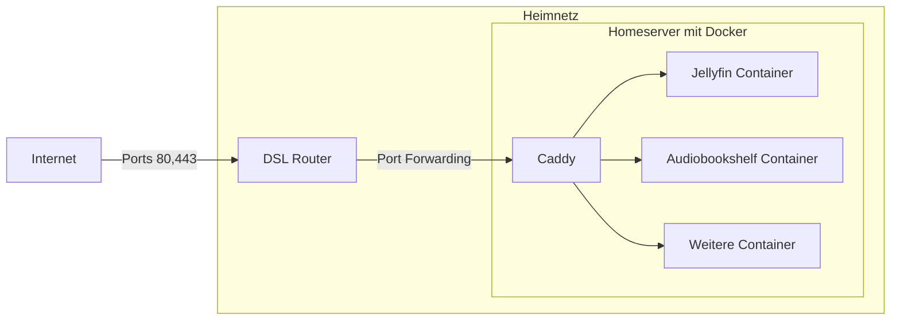
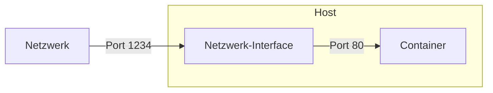

# Schulung Selfhosting

## Server zu Hause, statt IRGENDWO in der Cloud


---
transition: fade-out
---

# Agenda

* Überblick: Warum Selfhosting?
* Portfreigabe und Dyndns-Dienste
* Caddy als Reverse-Proxy für HTTPS
* Docker-compose Basics und Systemd-Template
* Konfigurieren und Betreiben von Diensten
* Weiter Übungen und individuelle Fragen

---
layout: default
---

# Motivation

* Unabhängigkeit von Drittanbietern
* Volle Kontrolle über die Daten
* Anpassungsfähigkeit und Flexibilität
* Kosteneffizienz
* Lernmöglichkeiten und Fähigkeitenentwicklung

---

# Warnungen

* Selfhosting ist nicht für jeden geeignet
* Selfhosting ist nicht für jeden Dienst geeignet
* Selfhosting ist nicht immer die einfachste/beste/günstigste/sicherste Lösung
* Wir schauen uns EINE Art an es zu machen

---

# Beispiel Setup

* Jellyfin
* Audiobookshelf
* Beides mit HTTPS



---

# Betriebssystem

* Ein beliebiges Linux-Betriebssystem
* Empfehlungen:
  * Debian Linux (stabil, einfach, viele Pakete, viele Anleitungen, viele Nutzer)
  * Raspberry Pi OS (baut auf Debian auf, für Raspberry Pi optimiert)
  * Ubuntu Server (stabil, einfach, viele Pakete)
* Prinzipiell geht auch jedes andere Linux-Betriebssystem (Systemd und Docker müssen laufen)
* Gentoo, Arch Linux und NixOS sind tolle Betriebssysteme, aber nicht für Anfänger geeignet
* Für heutigen Kurs: Debian Linux, DVD-Image (iso) herunterladen und installieren

---

# Downloads

* [Virtualbox](https://www.virtualbox.org)
* [Debian Linux](https://cdimage.debian.org/debian-cd/current/amd64/iso-dvd/) (amd64, dvd image)

---

# Tricks für Datenübertragung

* SSH Server nutzen
  * Client für Windows z.B. [Putty](https://www.chiark.greenend.org.uk/~sgtatham/putty/latest.html)
* Alternativ: [wormhole-william](https://github.com/psanford/wormhole-william) installieren und nutzen
  * Gibt es für mac/linux/windows und erlaubt einfache Dateiübertragung - auch von Zwischenablage

---

# Ip Adresse des Servers feststellen

* `ip a s` oder `ifconfig` auf dem Server ausführen
* Die IP-Adresse des Interfaces notieren, das mit dem Internet verbunden ist
* Achtung bei VirtualBox kann hier es notwendig sein, den Netzwerkmodus auf "Bridged" zu stellen

---

# Root user via ssh

* Es ist nicht gestattet als `root` user via ssh einzuloggen
* Daher melden wir uns als "normaler" User an und wechseln auf den Root account mit `su -`

---

# Accounts

* Domain bei einem Domain-Provider (z.B. Febas, AWS, etc.)
  * Login zur Hand haben
* Account bei einem Dyndns-Dienst (z.B. Duckdns)
  * Login zur Hand haben

---

# Hardware

* In diesem Kurs verwende ich eine Virtuelle Maschine mit Debian Linux
* Es kann aber auch andere Systeme verwendet werden
* Wichtig: Systemd und Docker müssen laufen
* Wir brauchen später den Pfad von `docker-compose` (je nach System Unterschiedlich)
* 1 GB Ram sollte ausreichen für Betriebssystem und Basis-Dienste
* Bei Resourcenhungrigen Diensten (z.B. Nextcloud) mehr Ram verwenden
* Der Computer / Raspberry Pi / VM braucht eine eigene IP-Adresse im lokalen Netzwerk (statisch/fest vergeben)

---

# Hardware anschaffen - Tipps

* Raspberry Pi 4/5, aber System auf externe SSD installieren
* Gebrauchte Hardware, oft sind Siemens, HP oder Dell Büro Desktops günstig zu bekommen (ca. 100-150€)
* Alternativ für diesen Kurs kann eine Virtuelle Maschine verwendet werden (z.B. Virtualbox)
* Tipp: Bei etwas potentem Rechner: Proxmox VE installieren und VMs erstellen
  * Für verschiedene Anwendungszwecke verschiedene Betriebssysteme
* Achtung: ARM Prozessoren (z.B. Raspberry) sind oft günstig / energiesparend, aber manche Docker Images gibt es nicht dafür (inzwischen sehr selten)

---


# Konventionen

* Wir verwenden den Pfad `/opt/data` für alle Daten
* Wir verwenden den Pfad `/opt/dockerfiles` für alle docker-compose Dateien
* Wir verwenden den Namen `dc@.service` für unsere Template-Datei
* Diese Konventionen sind nicht zwingend notwendig, aber erleichtern das Verständnis


---

# Docker Allgemein - 1

* Containerdienst
* Keine Virtualisierung des vollen Betriebssystems
* Nicht komplett neu, aber sehr populär geworden
* Einfache Verwaltung von Containern
* Extrem viele Dienste als Container verfügbar
* Alternativen: Podman, LXC, LXD
  * Etliche davon nutzen identische Images, sind also voll kompatibel!
* Lokale Sicherheit:
  * Achtung bei der Verwendung von Docker: Haben lokale Benutzer Rechte auf Docker können sie root-Rechte erlangen!
  * Images aus fremden Quellen können Schadcode enthalten

---

# Docker Allgemein - 2

* Image: Ein Image ist eine Vorlage für einen Container (z.B. ein Webserver Image)
* Container: Ein Container ist eine isolierte Umgebung, die eine Anwendung ausführen kann
* Vergleich bei Programmiersprachen: Image ist wie eine Klasse, Container ist wie ein Objekt
* `Dockerfile`: Eine Datei, die ein Image beschreibt (wenn man z.B. selbst ein Image erstellen möchte)

---

# Docker Allgemein - 3

* `docker-compose`: Tool um mehrere Container zu verwalten
* `docker-compose.yml`: Eine Datei im YAML Format, die mehrere Container beschreibt
* Volumes
  * Ein **Ordner**, der von einem Container verwendet wird
  * Kann in einen **lokalen Ordner** gemountet werden
  * Kann auch als **Volume-Container** verwendet werden
  * Es können auch **Geräte** und **Dienste** gemountet werden (z.B. X-Server, Drucker, ...)

---

# Docker Allgemein - 4

* Fertige Docker Images können aus dem Internet heruntergeladen werden
* Manchmal gibt es auch Dockerfile Dateien, mit denen man selbst Images erstellen kann
* Oft gibt es fertige Images für Dienste
* Diese finden sich oft auf [Docker Hub](https://hub.docker.com/)

---

# Docker Allgemein - 5

* Tags
  * Images haben neben ihrem Namen noch einen Tag (z.B. `nginx:latest` oder `nginx:1.19.10`)
  * Immer `latest` zu nehmen ist nicht immer empfehlenswert, da sich die Images ändern können. Updatepfade beachten!
  * Niemals zu aktualisieren ist nicht empfehlenswert, da Sicherheitslücken auftreten können
  * ➡️ Kompromiss aus aktualisieren und Komfort finden
  * Varianten
    * Oft gibt es verschiedene Varianten eines Images (z.B. `nginx:alpine`, `nginx:1.19.10-alpine`)
    * Diese Beschreiben oft das Basis-Image auf dem die Software Aufbaut (oft: `alpine` oder `debian`)
    * Macnhmal auch die verwendete Technolgie (z.B. `nextcloud:fpm` oder `nextcloud:apache`)

---

# Docker-compose allgemein

* Einfache Verwaltung von mehreren Containern
  * Beispiel: Nextcloud benötigt Datenbank, Redis, Cronjob, ...
  * Konfiguration aller für einen Dienst benötigten Container in einer Datei
  * Einfaches Starten und Stoppen aller Container
* Oft gibt es fertige docker-compose Dateien für Dienste
* Wir verwenden in diesem Kurs fast ausschließlich fertige docker-compose Dateien
* Weitere docker-compose Dateien finden wir oft bei den jeweiligen Projekten (z.B. Nextcloud)


---

# Docker installieren

* Befehler als root ausführen oder mit `sudo` voranstellen
* `apt update`
* `apt install nano` (für einen einfachen Editor)
* `apt install docker docker-compose` (für Docker und Docker-compose)
* Testen: `docker pull alpine` (ggf. mit `sudo`)

---

# Docker ausführen

Beispielcontainer:

```sh
docker run --rm -p 1234:80 tutum/hello-world
```

* `--rm` entfernt den Container nach dem Beenden
* `-p 1234:80` leitet den Port 1234 auf Port 80 im Container weiter
* `tutum/hello-world` ist der Name des Images, das wir verwenden
* Nun können wir auf [http://IP_ADRESSE:1234](http://IP_ADRESSE:1234) zugreifen



---

# Docker-compose Einführung - 1

* Wenn wir den gleichen Dienst nun mit `docker-compose` nutzen wollen, brauchen wir eine `docker-compose.yml` Datei

```yaml
version: "3.7" # Versionsnummer von docker-compose

services:
  hello-world: # Beliebig wählbarer Name unserers Dienstes
    image: tutum/hello-world # Name des Images
    ports:
      - "1234:80" # Portweiterleitung
```

* Befehl zum Starten:

```sh
docker-compose up
```

---

# Docker-compose Einführung - 2

* Weitere Befehle mit `docker-compose`
  * `docker-compose pull` Lade alle in `docker-compose.yml` benutzen Images herunter
  * `docker-compose up` Starte alle in `docker-compose.yml` benutzen Container
  * `docker-compose down` Stoppe alle in `docker-compose.yml` benutzen Container
  * `docker-compose logs` Zeige Logs aller in `docker-compose.yml` benutzen Container
  * `docker-compose ps` Zeige Status aller in `docker-compose.yml` benutzen Container
  * `docker-compose exec <name> <command>` Führe `<command>` in Container `<name>` aus
    * Damit kommt man in laufende Container via Kommandozeile hinein
    * Hier können aber auch Helfer das Leben erleichtern (z.B. lazydocker)


---

# Docker Helfer

⚠️ Bei allen Helfern muss Zugriff auf Docker erfolgen. Dies wird oft mit dem mounten des Docker-Sockets erreicht. Dies ist ein Sicherheitsrisiko - daher dürfen die Tools niemals ins Internet freigegeben werden.

* [Lazydocker](https://github.com/jesseduffield/lazydocker): Terminal UI für Docker
* [Portainer CE](https://www.portainer.io/) (Community Edition): Web UI für Docker


---

# Portainer als Beispiel

`docker-compose.yml`:

```yaml
version: "3"
services:
  portainer:
    image: portainer/portainer-ce:latest
    ports:
      - 9443:9443
    volumes:
      - /opt/data/portainer/data:/data
      - /var/run/docker.sock:/var/run/docker.sock
    restart: unless-stopped
```

* Volumes binden den Ordner `/opt/data/portainer/data` auf den Ordner `/data` im Container. Dort speichert Portainer seine Daten
* Der Ordner `/var/run/docker.sock` ist der Socket, über den Portainer mit Docker kommuniziert -> Wir geben diesen Ordner in den Container

---

# Portfreigabe allgemein

* Grundlagen der Portfreigabe
* Konfiguration des Routers für Selfhosting
* Auswahl und Einrichtung von Dyndns-Diensten
* Sicherheitsaspekte der Portfreigabe

---

# Portfreigabe - 1

* Portfreigabe ist notwendig, um Dienste von außen erreichbar zu machen
* Manche Service Provider erlauben keinerlei Portfreigaben
* Portfreigabe ist ein Sicherheitsrisiko, sollten also vorsichtig eingesetzt werden

---

# Portfreigabe - 2

* Zumeist muss ein Router so eingerichtet werden, dass dieser Anfragen an einen bestimmten Port an einen bestimmten Rechner im lokalen Netzwerk weiterleitet
* Die IP-Adresse des Rechners sollte statisch sein, damit die Portfreigabe nicht bei jeder Änderung der IP-Adresse neu eingerichtet werden muss
  * Entweder immer die gleiche IP adresse vergeben (z.B. via Router)
  * Oder IP Adresse statisch vergeben
* Die Portfreigabe sollte nur für die Ports eingerichtet werden, die tatsächlich benötigt werden
* Die Portfreigabe sollte nur für die Protokolle eingerichtet werden, die tatsächlich benötigt werden

---

# Portfreigabe - 3

* Falls kein Vertrag mit statischer IP (teuer!) vorhanden ist, muss eine dynamische IP-Adresse mit einem Dyndns-Dienst verknüpft werden
* Dyndns Dienst verknüpft eine Domain mit einer IP-Adresse
* Der Router muss die IP-Adresse an den Dyndns-Dienst melden
* Der Router muss die IP-Adresse regelmäßig an den Dyndns-Dienst melden
* Beispiel für Dyndns Dienst: duckdns.org

---

# Problematik Portfreigabe

* Nun muss für jeden einzelnen Dienst eine Portfreigabe eingerichtet werden
* Zudem wird jeder Dienst via http ausgeliefert
  * Unverschlüsselt
  * Unsicher
  * Viele Dienste verweitern den Dienst / müssen jedes Mal "unsicherheit akzeptieren" etc.
* Lösung: Reverse Proxy

---

# DNS Konfiguration - 1

* DNS ist das System, das Domainnamen in IP-Adressen auflöst
* Wir brauchen eine Zuordnung von einer Domain auf unsere IP, damit der Reverse Proxy die Anfragen an die richtigen Dienste weiterleiten kann
* Problem: Wir haben keine statische IP-Adresse
* Aber: Wir haben einen fixen Domainnamen durch den Dyndns-Dienst
* Lösung: Wir verwenden einen CNAME-Eintrag
* Wir setzen ALLE unsere Dienste mit EIGENEN Domains auf den CNAME-Eintrag des Dyndns Dienstes
* Beispiel:
  * `audiobookshelf.my-own-personal-domain.com CNAME meineigenerusername.duckdns.org`
  * `jellyfin.my-own-personal-domain.com CNAME meineigenerusername.duckdns.org`

---

# DNS Konfiguration - 2

* Prüfen der Konfiguration:
  * Wir prüfen nun den CNAME-Eintrag:
  * `dig audiobookshelf.my-own-personal-domain.com`
  * Hier sollte erst der `CNAME` von unserer Domain auf unserer Dyndns Domain zeigen
  * Ein zweiter Eintrage sollte die IP-Adresse unseres Routers zeigen
* Ist der `CNAME` Eintrag nicht vorhanden
  * Eintrag prüfen
  * Es kann dauern, bis der Eintrag aktualisiert ist
* Ist die Ip Adresse des Dyndns Eintrags nicht aktuell
  * Dyndns aktualisierung prüfen (Router, Skript, manuell)


---

# Dyndns - 1

* Dyndns ist ein Dienst, der eine Domain mit einer IP-Adresse verknüpft
* Wir brauchen einen Dyndns-Dienst, um unsere IP-Adresse mit einer Domain zu verknüpfen
* Wir brauchen eine Domain, um unsere Dienste von außen erreichbar zu machen
* [Duckdns](https://www.duckdns.org/) ist ein kostenloser Dyndns-Dienst
* Mit der Anleitung des jeweiligen Dienstes können wir die IP-Adresse an den Dyndns-Dienst melden
  * Viele Router haben eine eingebaute Funktion dafür
  * Ansonsten gibt es auch Programme, die die IP-Adresse an den Dyndns-Dienst melden können

---

# Dyndns - 2

* Prüfen der Konfiguration:
  * Abrufen des dyndns dienstes
  * `dig audiobookshelf.my-own-personal-domain.com`
  * Hier sollte die IP-Adresse meiner eigener Adresse angezeigt werden

---

# Reverse Proxy - 1

* Ein Reverse Proxy ist ein Server, der Anfragen an andere Server weiterleitet
* Der Reverse Proxy kann Anfragen anhand der Domain auf verschiedene Server weiterleiten
* Reverse Proxies z.B. nginx, traefik, caddy
* Hier im Kurs verwenden wir caddy
* Alternative Empfehlung: traefik

---

# Reverse Proxy - 2

* Vorteile Caddy:
  * Einfache Konfiguration
  * Automatische HTTPS-Konfiguration
  * Automatische Zertifikatsverlängerung
  * Open Source
  * Resourcenschonend

---

# Caddy - 1

* Unsere Dienste (z.B. hello-world) sind nun über http erreichbar
* Wir wollen aber https verwenden
* Lösung: Reverse-Proxy
* Wir verwenden caddy als Reverse-Proxy
* Alternativen: nginx, traefik, haproxy, ...
* Vorteile caddy:
  * Einfache Konfiguration
  * Automatische HTTPS-Konfiguration
  * Automatische Zertifikatsverlängerung

---

# Caddy - 2

`docker-compose.yml`:

```yaml
version: "3.7"

services:
  caddy:
    image: caddy:latest
    restart: unless-stopped
    cap_add:
      - NET_ADMIN
    ports:
      - "80:80"
      - "443:443"
      - "443:443/udp"
    volumes:
      - /opt/data/caddy/Caddyfile:/etc/caddy/Caddyfile
      - /opt/data/caddy/logs:/srv/log
      - /opt/data/caddy/data:/data
      - /opt/data/caddy/caddy_config:/config
```

---

# Caddy - 3

`/opt/data/caddy/Caddyfile`:
Mit willkürlicher Emailadresse, Domain, IP-Adresse und Port

```text
{
  email myname@my-own-personal-domain.com
  log {
    output file /srv/log/caddy.log
  }
}

meinservice.my-own-personal-domain.com {
  reverse_proxy 192.168.10.130:8141
}
```
---

# Caddy - 4

* Da praktische: Caddy besorgt automatisch Zertifikate von Let's Encrypt
* ACHTUNG! Sowohl der Port 80 als auch der Port 443 müssen auf den Caddy Container weitergeleitet werden
* Für die Challenge muss der Dienst aus dem Internet erreichbar sein
* Die Domain muss auf die IP-Adresse zeigen (z.B. via `CNAME` Eintrag)
* Wir brauchen nur angeben:
  * Emailadresse
  * (Sub-)Domain
  * Ip des Dienstes
  * Port des Dienstes
* Für jede Domain einen eigenen Block anlegen!
* Wichtig: Dienste, die nicht aus dem Internet erreichbar sind/sein sollen brauchen auf anderem Weg Zertifikate (z.B. via DNS Challenge)
  * Diese Lösungen sind aber nicht Teil dieses Kurses

---

# Caddy - 5

* Bei privaten Diensten (nur im eigenen Netz verfügbar)
* Öffentliches `CNAME` auf lokale IP Adresse
* Alternative: Lokaler DNS-Server, der die Domain auf die lokale IP-Adresse auflöst
* Alternative Wege für Zertifikate notwendig (z.B. Wildcard Zertifikate)

---

# Systemd allgemein

* Systemd ist ein Dienst, der auf vielen Linux-Systemen läuft
* Systemd ist für das Starten und Stoppen von Diensten zuständig
* Systemd kann auch Container starten und stoppen
* Mit Systemd lassen sich einfache Skripte für das Starten und Stoppen von Containern schreiben
* Wir schreiben ein Systemd-Template für das Starten und Stoppen von Containern

---

# Systemd Template

```systemd
[Unit]
Description=%i service with docker compose
Requires=docker.service
After=docker.service

[Service]
Restart=always
TimeoutStartSec=1200

WorkingDirectory=/opt/dockerfiles/%i

# Remove old containers, images and volumes and update it
ExecStartPre=/usr/bin/docker-compose down -v
ExecStartPre=/usr/bin/docker-compose rm -fv
ExecStartPre=/usr/bin/docker-compose pull

# Compose up
ExecStart=/usr/bin/docker-compose up

# Compose down, remove containers and volumes
ExecStop=/usr/bin/docker-compose down -v

[Install]
WantedBy=multi-user.target
```

---

# Systemd template verweden

* Kopieren des Templates in eine neue Datei unter dem Pfad `/etc/systemd/system/dc@.service`
* Um einen konkreten Dienst anzulegen muss eine Datei unter `/opt/dockerfiles/<name>/docker-compose.yml` angelegt werden
* Um den Dienst nun zu verwenden muss `systemctl enable dc@<name>` ausgeführt werden. Damit ist der Dienst automatisch beim Starten des Systems aktiviert
* Mit `systemctl disable dc@<name>` können wir den Dienst deaktivieren
* Ab dann können wir mit `systemctl start dc@<name>` und `systemctl stop dc@<name>` starten und stoppen
* Mit `systemctl restart dc@<name>` können wir den Dienst neu starten
* Mit `systemctl status dc@<name>` können wir den Status des Dienstes abfragen

---

# Dienst Audiobookshelf

* [Audiobookshelf](https://www.audiobookshelf.org/) ist ein Dienst zum Verwalten von Hörbüchern
* Audiobookshelf ist ein Dienst, der auf Node.js basiert

```yaml
version: "3.7"

services:
  audiobookshelf:
    image: ghcr.io/advplyr/audiobookshelf
    ports:
      - 8472:80
    volumes:
      - /opt/data/audiobookshelf/audiobooks:/audiobooks
      - /opt/data/audiobookshelf/metadata:/metadata
      - /opt/data/audiobookshelf/config:/config
    restart: unless-stopped

```

---

# Dienst Jellyfin - 1

* [Jellyfin](https://jellyfin.org/) ist ein Dienst zum Verwalten von Medien
* Jellyfin ist ein Dienst, der auf .NET basiert
* Jellyfin erlaubt das Streamen von Videos und Musik und das Anschauen von Bildern
* Jellyfin kann auch als DLNA-Server verwendet werden
* Als Clients können z.B. Amazon Fire Sticks, Kodi, VLC, Android-Apps, iOS-Apps, Webbrowser verwendet werden

---

# Dienst Jellyfin - 2

```yaml
version: '3.5'
services:
  jellyfin:
    image: jellyfin/jellyfin
    container_name: jellyfin
    user: 1000:1000
    network_mode: 'host'
    volumes:
      - /opt/data/jellyfin/config:/config
      - /opt/data/jellyfin/cache:/cache
      - /opt/data/jellyfin/media:/media
    restart: 'unless-stopped'
    # Optional - alternative address used for autodiscovery
    environment:
      - JELLYFIN_PublishedServerUrl=http://jellyfin.my-own-personal-domain.com
    # Optional - may be necessary for docker healthcheck to pass if running in host network mode
    extra_hosts:
      - "host.docker.internal:host-gateway"
```

---

# Dienst Wordpress - 1

* [Wordpress](https://wordpress.org/) ist ein Dienst zum Verwalten von Webseiten
* Wordpress ist ein Dienst, der auf PHP basiert
* Wordpress erlaubt das Erstellen von Webseiten mit einem WYSIWYG-Editor
* Wordpress kann mit Themes und Plugins erweitert werden
* Wordpress kann auch als Blog verwendet werden
* Wordpress ist das beliebteste CMS (Content Management System) der Welt
* Achtung: Wordpress braucht neben Docker auch Plugin und Theme Updates!

---

# Dienst Wordpress - 2

```yaml
version: '3.9'
services:
    wordpress:
        image: wordpress:latest
        depends_on:
            - db
        ports:
            - 8002:80
        restart: always
        environment:
            WORDPRESS_DB_HOST: db:3306
            WORDPRESS_DB_USER: wordpress
            WORDPRESS_DB_PASSWORD: wordpress
        volumes:
            - /opt/data/wp_myhomepage/wordpress/:/var/www/html/
    db:
        image: "mariadb:10"
        restart: 'always'
        volumes:
            - /opt/data/wp_myhomepage/mariadb:/var/lib/mysql
        environment:
            MARIADB_ROOT_PASSWORD: geology-carve-delirious-ventricle-blinking-sprite
            MARIADB_DATABASE: wordpress
            MARIADB_USER: wordpress
            MARIADB_PASSWORD: wordpress

```

---

# Wartung - 1

* Das System selbst muss regelmäßig gewartet werden
* Das Betriebssystem muss regelmäßig aktualisiert werden
  * Hier sind auch automatisierte Updates möglich
  * Achtung: Updates können auch Probleme verursachen
  * Zudem: Betriebssystem werden nicht unendlich lange unterstützt -> Langfristig updaten ist wichtig!

---

# Wartung - 2

* Docker Images müssen regelmäßig aktualisiert werden
  * Strategien hier sind enorm unterschiedlich
  * Manche Images werden nur alle paar Monate aktualisiert
  * Manche Images werden täglich aktualisiert
  * Achtung bei Image updates
    * Vielleicht sind Updates nicht kompatibel ohne migration
    * Manche Dienste brauchen manuelle Updates bei Versionswechseln (Neue führende Nummer bei der Versionsnummer?)
    * Manche Dienste brauchen manuelles Patchen auf der Kommandozeile
    * Wir müssen uns also pro Dienst informieren, wie wir Updates durchführen
  * Vor Updates IMMER Backups anfertigen

---

# Wartung - 3

* Neben dem aktualisieren neuer Docker Images sollten die alten entfernt werden (Speicherplatz!)
* Dies passiert z.B. mit dem `docker system prune` Befehl
* Achtung: Dieser Befehl entfernt auch alle nicht mehr verwendeten Volumes!
* Allgemeiner Tipp: Tool [topgrade](https://github.com/topgrade-rs/topgrade) verwenden, um System und Docker Images zu aktualisieren

---

# Backup - 1

* "Kein Backup - Kein Mitleid" -> Wir brauchen Backup
* Backup ist sehr gut überschaubar mit:
  * Nur Daten-Ordner (keine Volumes) und alle unter `/opt/data` legen
  * Alle Docker-Definitionen unter `/opt/dockerfiles`
  * Alle Systemd-Definitionen unter `/etc/systemd/system`
* Also sichern wir vor allem diese Pfade
* Wir können auf einem anderen System / anderen Rechner die Daten einfach wiederherstellen
  * Wichtig: Dort müssen die Pfade gleich sein!
  * Zudem: Wir brauchen wieder unser Systemd-Template und müssen die Dienste "anknipsen"
* Backup-Tool Empfehlung: `restic` (für Backups auf externe Festplatten, in die Cloud oder überall hin)

---

# Backup - 2

* Wichtig: Was sichern wir alles?
* Mein Vorschlag:
* Pfade mit sichern:
  * `/opt/data`
  * `/opt/dockerfiles`
  * `/etc/systemd/system`
* Das ganze je nach Bedarf zwischen wöchentlich und täglich ausführen


---

# Backup - 3

* Eigenschaften von `restic`:
  * Inkrementelle Backups: Nur neue Daten werden gesichert.
  * Cloud Backends: Backups können in die Cloud gesichert werden.
  * Verschlüsselung: Backups werden sicher verschlüsselt.
  * Deduplizierung: Datenbestandteile, die in anderen gefunden werden, werden nicht erneut gesichert.
    * Beispiel: Wenn zwei Bilder identisch sind, wird nur eines gesichert.
    * Speichern zwei Rechner die gleiche Datei, wird diese nur einmal gesichert.
    * Sogar in Datei-Fragmenten wird dedupliziert.
  * Effizient: restic ist sehr effizient und schnell.
  * Betriebssystem: restic läuft auf Linux, macOS und Windows.
* Webseite: [restic.net](https://restic.net/)

---

# Weitere Imspiration für Services

* [Immich](https://github.com/immich-app/immich) ist ein Dienst für Bilder-Backup von Mobilgeräten
* [Nextcloud](https://nextcloud.com/) ist ein Dienst für Datei-Backup und Synchronisation
* [Wallabag](https://wallabag.org/) ist ein Dienst zum Speichern von Webseiten
* [Paperless ngx](https://github.com/paperless-ngx/paperless-ngx) ist ein Dienst zum Speichern von (gescannten) Dokumenten

---

# Weitere Resourcen

* [Awesome Selfhosted](https://github.com/awesome-selfhosted/awesome-selfhosted)
* [Subreddit Selfhosted](https://www.reddit.com/r/selfhosted/)
* [Awesome Docker](https://github.com/veggiemonk/awesome-docker)

---

# Abschluss

[Diese Schulung](https://github.com/derphilipp/schulung_selfhosting) · [Schulung ansehen](https://derphilipp.github.io/schulung_selfhosting) · [Kontakt](https://philipp-weissmann.de)
